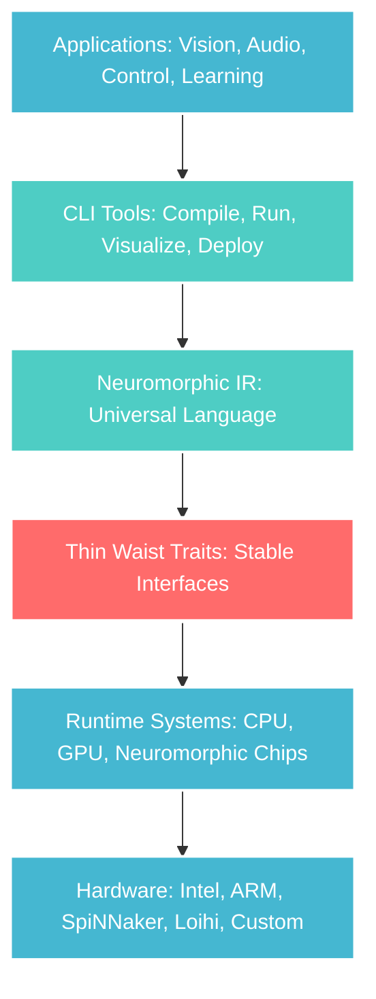

# Part III: The Architecture 🏗️

Welcome to the engine room of neuromorphic computing! In this section, you'll discover why hSNN is the most developer-friendly neuromorphic platform ever built. The secret isn't just good software engineering—it's **architectural philosophy** that makes neuromorphic computing accessible without sacrificing performance.

## The "Thin Waist" Philosophy

Imagine the Internet. At its core is a simple protocol (IP) that everyone agrees on. Above it, countless applications flourish. Below it, any network technology can participate. This **thin waist** design is what made the Internet unstoppable.

hSNN applies the same principle to neuromorphic computing:



**The magic:**
- **Above the waist:** Infinite innovation in applications and tools
- **At the waist:** Rock-solid stability that never breaks
- **Below the waist:** Freedom to optimize for any hardware

## Why This Matters for You

### If You're Building Applications
- **Your code never breaks** when hSNN improves internally
- **Deploy anywhere** without rewriting your neuromorphic networks
- **Focus on algorithms** instead of plumbing
- **Leverage ecosystem** of tools and libraries

### If You're Optimizing Performance
- **Swap implementations** without changing interfaces
- **Target new hardware** by implementing thin waist traits
- **Profile precisely** through well-defined boundaries
- **Optimize incrementally** without breaking existing code

### If You're Doing Research
- **Compare fairly** across different implementations
- **Reproduce easily** by targeting the same interfaces
- **Share components** that work in any hSNN system
- **Publish confidently** knowing your work will remain relevant

## Your Journey Through This Section

### 🎯 **Chapter 1: [Why Architecture Matters](why-architecture-matters.md)**
Discover why most neuromorphic platforms fail developers and how hSNN's architecture solves fundamental problems in the field.

**Key Insights:**
- The complexity crisis in neuromorphic computing
- How bad architecture kills good research
- Why the thin waist enables innovation
- Real costs of architectural technical debt

### 🔌 **Chapter 2: [Stable Interfaces](stable-interfaces.md)**
Master the trait system that makes hSNN's guarantees possible. Learn to build on solid foundations that never shift.

**Key Insights:**
- The anatomy of thin waist traits
- Capability-based design patterns
- Zero-cost abstraction techniques
- Evolution strategies for long-term stability

### 🧠 **Chapter 3: [The IR Layer](ir-layer.md)**
Deep dive into Neuromorphic IR (NIR)—the universal language that makes neuromorphic computing portable and optimizable.

**Key Insights:**
- Why IRs are crucial for complex systems
- NIR's design principles and trade-offs
- Optimization passes and transformations
- Extending NIR for custom operations

### 📦 **Chapter 4: [Binary Schemas](binary-schemas.md)**
Understand the high-performance data formats that make hSNN fast, compact, and interoperable across languages and platforms.

**Key Insights:**
- Zero-copy serialization techniques
- Versioning strategies for evolving formats
- Cross-language compatibility
- Performance vs. flexibility trade-offs

## Core Architectural Principles

### 1. **Separation of Concerns**

hSNN cleanly separates different aspects of neuromorphic computing:

```rust
// WRONG: Everything mixed together
struct MonolithicNeuron {
    // Biological parameters
    membrane_potential: f64,
    threshold: f64,
    
    // Network connectivity  
    incoming_synapses: Vec<Synapse>,
    outgoing_synapses: Vec<Synapse>,
    
    // Simulation mechanics
    last_update_time: Time,
    spike_queue: VecDeque<Spike>,
    
    // Learning algorithms
    stdp_trace: f64,
    homeostatic_scaling: f64,
    
    // Hardware mapping
    core_assignment: CoreId,
    memory_address: MemoryAddress,
    
    // Visualization
    color: Color,
    position: (f32, f32),
}
```

```rust
// RIGHT: Clean separation
trait NeuronDynamics {
    fn update(&mut self, dt: Time, input: f64) -> Option<Spike>;
}

trait Connectivity {
    fn connect(&mut self, pre: NeuronId, post: NeuronId, weight: f64);
}

trait Learning {
    fn update_weights(&mut self, pre_spike: Time, post_spike: Time);
}

trait HardwareMapping {
    fn assign_to_core(&self, neuron: NeuronId) -> CoreId;
}
```

**Benefits:**
- **Composability:** Mix and match implementations
- **Testability:** Test each concern independently
- **Optimization:** Specialize each layer for performance
- **Understanding:** Reason about one thing at a time

### 2. **Progressive Disclosure**

hSNN reveals complexity only when you need it:

```rust
// Level 1: Simple CLI usage
// snn nir compile --topology "10->20->5" --output network.nirt

// Level 2: Configuration files
// topology = "10->20->5"
// plasticity = "stdp"

// Level 3: Direct NIR
// %layer = neuron.lif<v_th=1.0>() -> (20,)

// Level 4: Custom implementations
trait CustomNeuron: NeuronDynamics {
    fn my_special_behavior(&mut self);
}

// Level 5: Hardware optimization
unsafe trait DirectMemoryAccess {
    fn raw_memory_ptr(&self) -> *mut u8;
}
```

**Philosophy:** You can go as deep as needed without breaking higher-level abstractions.

### 3. **Capability-Based Design**

Features are exposed through capability traits:

```rust
// Basic capability
trait Simulate {
    fn step(&mut self, dt: Time);
}

// Advanced capability
trait RealTimeSimulate: Simulate {
    fn step_realtime(&mut self, dt: Time) -> Result<(), TimingError>;
}

// Hardware-specific capability
trait NeuromorphicAccelerate: Simulate {
    fn offload_to_chip(&mut self) -> Result<(), HardwareError>;
}

// Usage: Check capabilities at runtime
if let Some(accelerated) = sim.as_any().downcast_ref::<dyn NeuromorphicAccelerate>() {
    accelerated.offload_to_chip()?;
} else {
    sim.step(dt);  // Fallback to software
}
```

**Benefits:**
- **Graceful degradation:** Works on any hardware
- **Feature discovery:** Probe capabilities at runtime
- **Optimization opportunities:** Use best available implementation
- **Forward compatibility:** New capabilities don't break old code

### 4. **Data-Oriented Design**

hSNN organizes around data flow, not object hierarchies:

```rust
// Traditional OOP: Objects own their data
class Neuron {
    private double potential;
    private List<Synapse> synapses;
    
    public void update() {
        // Scattered memory access
        for (Synapse s : synapses) {
            potential += s.getWeight() * s.getInput();
        }
    }
}
```

```rust
// Data-oriented: Separate data from behavior
struct NeuronArray {
    potentials: Vec<f64>,          // Contiguous memory
    thresholds: Vec<f64>,          // Parallel arrays
    last_spike_times: Vec<Time>,   // Cache-friendly
}

struct SynapseMatrix {
    weights: CSRMatrix<f64>,       // Sparse, optimized format
    pre_neurons: Vec<NeuronId>,    // Connectivity data
    post_neurons: Vec<NeuronId>,
}

// Behavior operates on data arrays
fn update_neurons(neurons: &mut NeuronArray, synapses: &SynapseMatrix) {
    // Vectorized operations, cache-friendly access
    neurons.potentials.par_iter_mut()
        .zip(neurons.thresholds.par_iter())
        .for_each(|(potential, threshold)| {
            // SIMD-optimized operations
        });
}
```

**Performance benefits:**
- **Cache efficiency:** Related data stored together
- **Vectorization:** SIMD operations on arrays
- **Parallelization:** Easy to split across cores
- **Memory efficiency:** No object overhead

## The Stack in Detail

### Application Layer: Where You Work
```rust
// High-level, domain-specific APIs
use hSNN::vision::EdgeDetector;
use hSNN::audio::CochlearModel;
use hSNN::control::MotorController;

let vision_system = EdgeDetector::new()
    .with_receptive_field(5, 5)
    .with_threshold(0.8)
    .build()?;
```

### CLI Layer: Development Tools
```rust
// Command-line interface built on stable APIs
pub fn compile_command(args: CompileArgs) -> Result<()> {
    let network = NetworkBuilder::from_config(&args.config)?;
    let nir = network.to_nir()?;
    nir.verify()?;
    nir.save(&args.output)?;
    Ok(())
}
```

### NIR Layer: Universal Language
```rust
// Intermediate representation for optimization and portability
pub struct NIRModule {
    operations: Vec<Operation>,
    connections: Graph<OpId>,
    metadata: ModuleMetadata,
}

impl NIRModule {
    pub fn optimize(&mut self) -> Result<()> {
        self.dead_code_elimination()?;
        self.constant_folding()?;
        self.operator_fusion()?;
        Ok(())
    }
}
```

### Trait Layer: Thin Waist
```rust
// Stable interfaces that never change
pub trait NeuronDynamics {
    type State;
    type Input;
    type Output;
    
    fn update(&mut self, state: &mut Self::State, input: Self::Input) -> Self::Output;
}

pub trait NetworkTopology {
    fn connect(&mut self, source: NeuronId, target: NeuronId, weight: f64) -> Result<()>;
    fn disconnect(&mut self, source: NeuronId, target: NeuronId) -> Result<()>;
}
```

### Runtime Layer: Execution Engines
```rust
// Optimized implementations for different targets
pub struct CPURuntime {
    thread_pool: ThreadPool,
    memory_pool: MemoryPool,
}

pub struct GPURuntime {
    cuda_context: CudaContext,
    kernels: CompiledKernels,
}

pub struct NeuromorphicRuntime {
    chip_driver: ChipDriver,
    routing_table: RoutingTable,
}
```

### Hardware Layer: Physical Targets
```rust
// Hardware abstraction for deployment
pub trait ComputeTarget {
    type Error;
    
    fn capabilities(&self) -> Capabilities;
    fn execute(&mut self, program: &Program) -> Result<ExecutionResult, Self::Error>;
    fn profile(&self) -> PerformanceMetrics;
}
```

## Design Patterns in Action

### Pattern 1: The Adapter Pattern for Hardware
```rust
// Any hardware can participate by implementing the thin waist
struct LoihiAdapter {
    chip: LoihiChip,
}

impl NeuronDynamics for LoihiAdapter {
    type State = LoihiNeuronState;
    type Input = LoihiSpike;
    type Output = Option<LoihiSpike>;
    
    fn update(&mut self, state: &mut Self::State, input: Self::Input) -> Self::Output {
        // Translate to Loihi-specific operations
        self.chip.process_spike(state, input)
    }
}
```

### Pattern 2: The Strategy Pattern for Algorithms
```rust
// Different learning algorithms through the same interface
trait LearningRule {
    fn update_weight(&self, pre_time: Time, post_time: Time, current_weight: f64) -> f64;
}

struct STDPRule { /* ... */ }
struct BCMRule { /* ... */ }
struct HebbianRule { /* ... */ }

// Usage
fn apply_learning<L: LearningRule>(rule: &L, synapse: &mut Synapse, pre_spike: Time, post_spike: Time) {
    synapse.weight = rule.update_weight(pre_spike, post_spike, synapse.weight);
}
```

### Pattern 3: The Builder Pattern for Complexity Management
```rust
// Complex networks built incrementally
NetworkBuilder::new()
    .add_layer(LayerSpec::lif().size(100).threshold(1.0))
    .add_layer(LayerSpec::lif().size(50).threshold(1.2))
    .connect_layers(0, 1, ConnectionSpec::fully_connected().weight(0.3))
    .add_learning_rule(LearningSpec::stdp().lr(0.01))
    .build()?
```

## Performance Through Architecture

### Memory Layout Optimization
```rust
// Structure of Arrays (SoA) for cache efficiency
#[repr(C)]
pub struct NeuronSoA {
    #[align(64)]  // Cache line aligned
    potentials: AlignedVec<f64>,
    thresholds: AlignedVec<f64>,
    last_spikes: AlignedVec<Time>,
}

// Enables vectorized operations
impl NeuronSoA {
    pub fn update_vectorized(&mut self, inputs: &[f64]) {
        self.potentials.par_iter_mut()
            .zip(inputs.par_iter())
            .zip(self.thresholds.par_iter())
            .for_each(|((potential, &input), &threshold)| {
                *potential = (*potential + input).min(threshold);
            });
    }
}
```

### Zero-Copy Serialization
```rust
// Binary formats designed for direct memory mapping
#[repr(C)]
pub struct SerializedNetwork {
    header: NetworkHeader,
    neuron_data: &'static [u8],  // Direct memory view
    synapse_data: &'static [u8], // No allocation needed
}

impl SerializedNetwork {
    pub fn neurons(&self) -> &[Neuron] {
        // Cast bytes directly to struct array - zero copy!
        unsafe { 
            std::slice::from_raw_parts(
                self.neuron_data.as_ptr() as *const Neuron,
                self.header.neuron_count as usize
            )
        }
    }
}
```

### Compile-Time Optimization
```rust
// Traits enable compile-time specialization
trait NetworkSize {
    const NEURONS: usize;
    const SYNAPSES: usize;
}

struct SmallNetwork;
impl NetworkSize for SmallNetwork {
    const NEURONS: usize = 100;
    const SYNAPSES: usize = 1000;
}

// Compiler can optimize based on constants
impl<N: NetworkSize> Simulate for FixedSizeNetwork<N> {
    fn step(&mut self, dt: Time) {
        // Arrays with compile-time known sizes
        let mut potentials: [f64; N::NEURONS] = [0.0; N::NEURONS];
        // Compiler can unroll loops, eliminate bounds checks
    }
}
```

## What You'll Master

By the end of this section, you'll understand:

### **Architectural Thinking**
- How to design systems that grow without breaking
- Why interfaces matter more than implementations
- How to balance flexibility with performance
- When to abstract and when to be concrete

### **Practical Skills**
- Implementing custom neuromorphic algorithms
- Extending hSNN for new hardware targets
- Optimizing performance through architectural choices
- Debugging at the interface boundaries

### **System Design**
- Creating stable APIs that evolve gracefully
- Managing complexity through layered design
- Making trade-offs between different quality attributes
- Building systems that outlast their original requirements

## Prerequisites

### Technical Foundation
- **Rust knowledge:** Traits, generics, lifetimes
- **Systems thinking:** Understanding of abstractions and interfaces
- **Performance awareness:** Cache, vectorization, parallelization basics

### Conceptual Understanding
- **Software architecture:** Design patterns and principles
- **Neuromorphic computing:** From Parts I and II of this book
- **Distributed systems:** Interfaces, protocols, compatibility

## Ready to Dive Deep?

Understanding architecture isn't just about reading code—it's about seeing the **patterns** that make complex systems manageable and the **principles** that make them last.

**[Start with Chapter 1: Why Architecture Matters →](why-architecture-matters.md)**

Or explore specific topics:
- **[Stable Interfaces →](stable-interfaces.md)** if you want to understand the trait system
- **[The IR Layer →](ir-layer.md)** if you're interested in compilation and optimization
- **[Binary Schemas →](binary-schemas.md)** if you want to understand data formats

---

*"Architecture is about the important stuff. Whatever that is."* — Ralph Johnson

*"In hSNN, the important stuff is making neuromorphic computing accessible without sacrificing performance."* — hSNN Architecture Team
